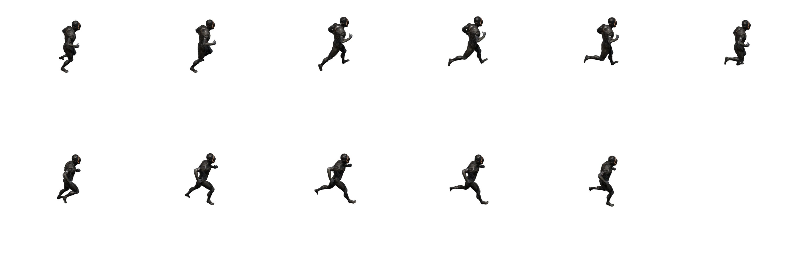
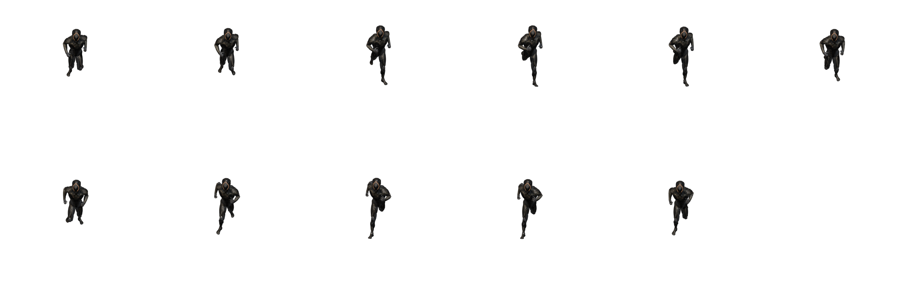

This project is intended to be used with a Blender script that generate actions sprites and is specifically designed for converting static animated 3D models into 2D actions spritesheets.

## Source

This repository is an extension upon the [blender_scripts](https://github.com/FoozleCC/blender_scripts) project, offering additional features for my own convenient needs.

## Motivation

The original repository enables users to render a selected object from 8 directional angles, resulting in a folder for each action containing multiple folder for each angles. Each angles containing frames as PNG images. The goal is to enhance this functionality by extending the script to handle 4, 16 and 32 angles, providing more detailed rendering options.

Additionally, this repository adds a way to compact each set of PNG frames into their own spritesheets. This improvement not only streamlines the storage structure but also facilitates easier integration into applications or projects requiring sprite-based animations. The motivation is to optimize the rendering process and output organization for users working with a broader range of directional angles.

## Features

Expanded Angles: The script has been cloned/modified to handle 4, 16 and 32 directional angles, providing more detailed rendering options for objects.

Sprite Sheet Generation: Each set of frames from the rendered angles is compacted into its own spritesheet, making it easier to manage and use in applications.

## Requirements

This project use rust to compact each set of PNG frames into their own spritesheets.
If you haven't installed Rust yet, you can do so by following the instructions on the official Rust website: https://www.rust-lang.org/tools/install

## Usage

1. Clone the repository:

```
git clone https://github.com/Maghwyn/blender_directional_spritesheets.git
cd blender_directional_spritesheets
```

2. Install Dependencies and compile the project:

```
cargo build
```

3. Modify the main.rs

/!\ At this point, you will need to have executed the python script inside blender /!\
You will need to change the properties `IN_FOLDER_PATH` and `OUT_FOLDER_PATH` depending on your OS and folder preferences.
You can optionally change `MAX_SPRITE_PER_ROW` to fit yours needs.

4. Run the script

```
cargo run
```

## Spritesheets example




## License

This project is licensed under the MIT License - see the [LICENSE](https://github.com/Maghwyn/blender_directional_spritesheets/blob/main/LICENSE) file for details.
